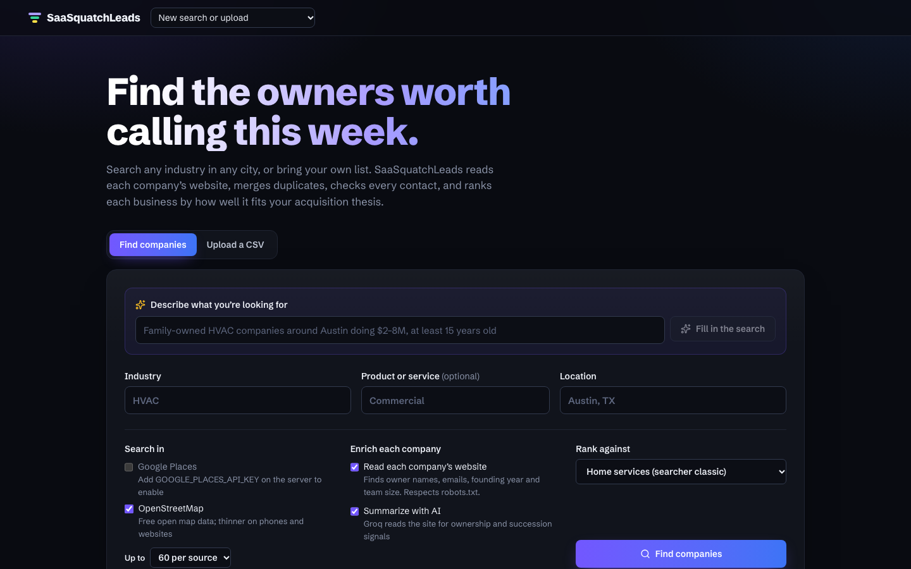
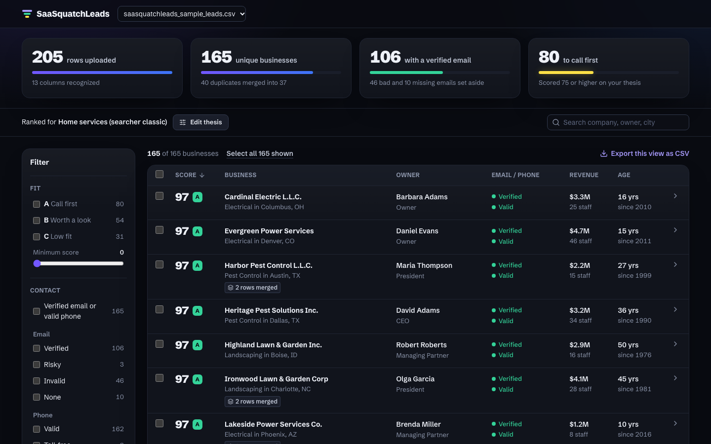
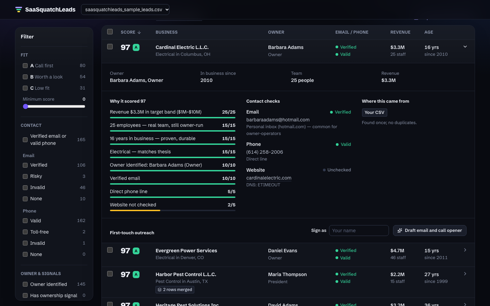
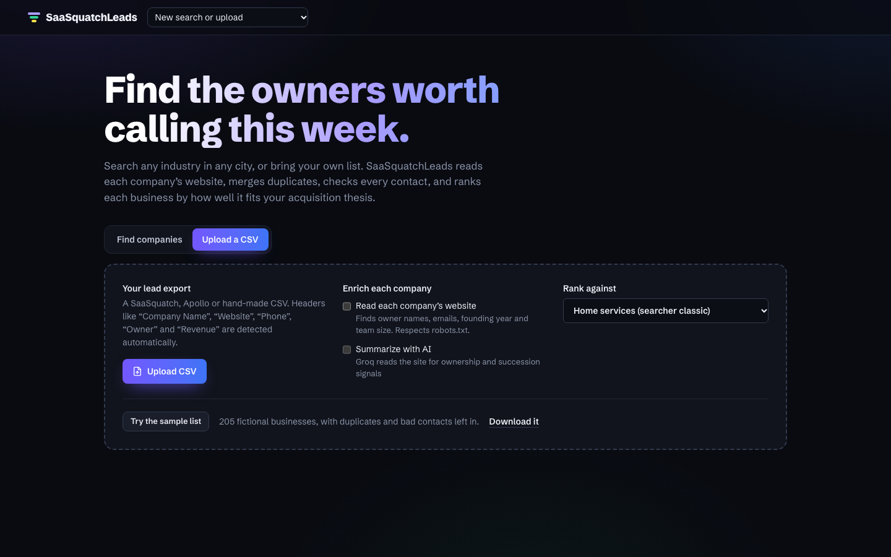
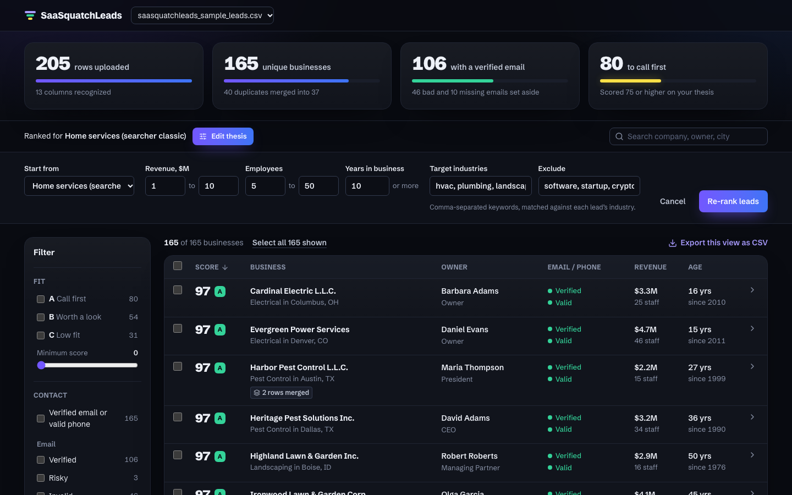
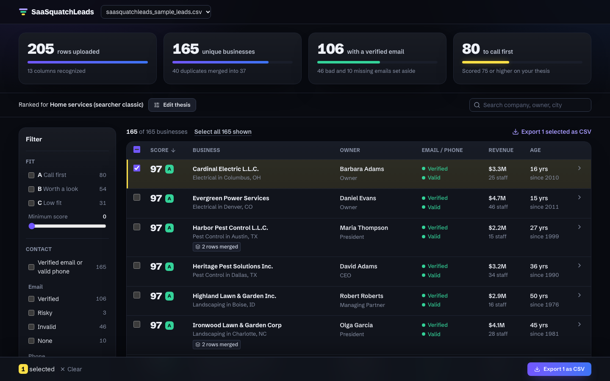
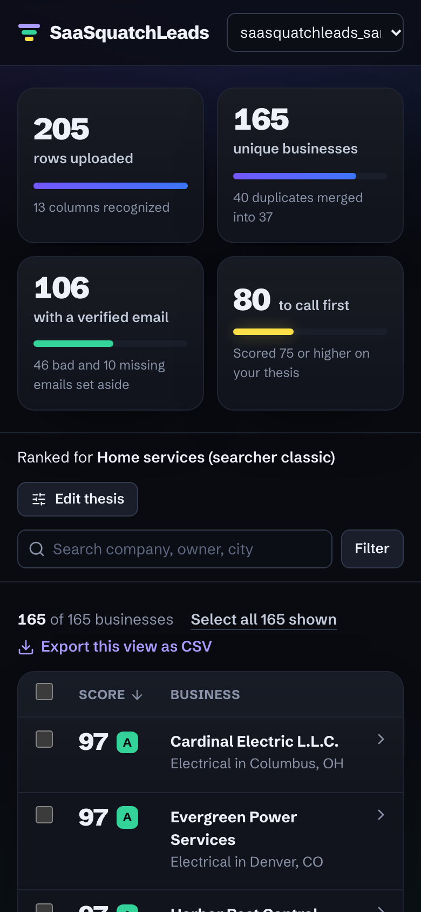
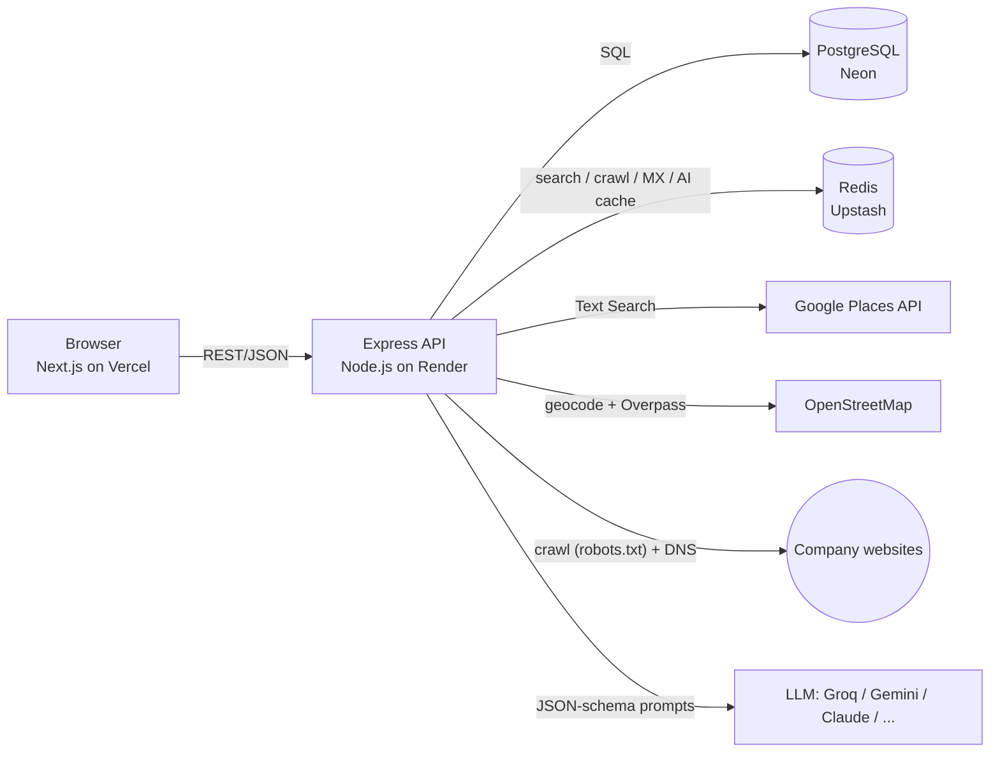

# SaaSquatchLeads

**Find companies by industry and location (or upload a list), learn who owns them, and get a clean, verified, ranked call list.**

This is an independent pre-work project for Caprae Capital's Full Stack Developer challenge. It reimagines the Company Finder of [SaaSquatch Leads](https://www.saasquatchleads.com/) with deduplication, enrichment, validation and acquisition-fit scoring added; it is not the official product. It's for the people who use lead tools like that one: searchers, acquisition entrepreneurs and the cold-callers who work for them.

A directory search gives you names, phones and websites. That isn't what a searcher needs. They need to know:
- who owns the business
- how long it's been around
- whether it's family-owned or the owner is near retirement
- whether the email will bounce
- which of 60 results to call first

SaaSquatchLeads answers those in one pass:

**Find companies (Google Places + OpenStreetMap) or upload a CSV → Merge duplicates across sources → Read each company's website → AI extracts owner, history and succession signals → Check every contact → Score acquisition fit → Draft outreach → Export CSV**







<details>
<summary>More screenshots: CSV upload, thesis editor, selection, mobile</summary>









</details>

---

## Features

### 0. Company Finder: search by industry + location
- **Search inputs:** industry, an optional product/service, and a location, the same inputs as the original SaaSquatch Leads Company Finder.
- **Google Places API (New)** (optional key):
  - Official, licensed data: name, address, phone, website, star rating, review count.
  - Up to 60 results per query, paginated.
  - Permanently closed businesses are dropped.
- **OpenStreetMap** (free, no key):
  - Nominatim geocodes the location; Overpass queries business tags mapped from the industry (e.g. HVAC → `craft=hvac`).
  - It also matches the industry keyword in the business name.
  - Data © OpenStreetMap contributors (ODbL).
- **Cross-source merging:** both sources run in parallel. Results are cached for 24h, which saves API cost and makes repeat demos instant. The same business found by both is merged into one lead tagged "found in 2 sources".
- **Why not scrape Google Maps directly?** It breaks Google's terms and gets IP-blocked. The official API gives better data, legally.

### 0.5 Website crawler + AI enrichment
- **Polite crawler:** for every company with a website, SaaSquatchLeads reads the homepage plus up to 3 About/Contact/Team pages.
  - It honours `robots.txt` and identifies itself.
  - Limits: 6s timeouts, 1.5 MB page cap, HTML only. Results are cached per domain for 7 days.
- **What it extracts:**
  - Emails (it picks the owner's personal address over `info@`) and direct phones.
  - Founding year ("since 1986", "35 years in business").
  - Team size ("team of 28 technicians").
  - Owner name ("Rick Alvarez, Owner", "Founded by …").
  - BBB, LinkedIn, Facebook and Yelp links.
  - Signals: family-owned, second-generation, owner-operated, veteran-owned, retirement/succession mentions.
- **An AI model** (optional; any provider, free tiers work) reads the same pages and returns JSON matching a schema:
  - owner and title
  - founding year and headcount, **only when stated** (the prompt forbids guessing)
  - services offered
  - ownership/succession signals
  - a two-sentence summary and an acquisition note
- **Fills gaps only, with provenance:** enrichment never overwrites data you supplied. Every filled field records where it came from (*from their website*, *read by AI*, *estimated*), and the UI shows it.
- **Revenue estimate:** when there's no revenue, it's estimated from headcount × industry revenue-per-employee benchmarks. It's labelled "~$2.6M (estimated from team size)", never shown as fact.
- **More AI features:**
  - **Describe your search in plain English:** "Family-owned HVAC companies around Austin doing $2–8M, at least 15 years old" → the AI fills the industry, location and scoring criteria.
  - **Outreach writer:** one click drafts a respectful first-touch email and a 15-second call opener from that lead's facts only. It has copy and "open in mail app" buttons, and is saved on the lead.
- **AI is optional:** without an AI key, everything else still works with rule-based extraction.
- **Any provider:** `AI_PROVIDER` selects Groq, Gemini, OpenRouter, OpenAI, Claude, or any OpenAI-compatible server (e.g. local Ollama).
  - It requests strict JSON-schema output and falls back to JSON mode, then to plain text, if a model doesn't support it.
  - The response is normalized to the schema either way.
- **Free-tier friendly:** calls are paced (`AI_RPM`), run 2 at a time, and are capped at 40 AI reads per search (`AI_MAX_PER_JOB`, spent on the most-reviewed businesses first). 429s are retried with `Retry-After`. Results are cached per domain for 7 days.

### 1. Deduplication: one business per row
- **Normalizes** every field before comparing:
  - Domains: `HTTPS://www.Acme.com/about` → `acme.com`
  - Phones: E.164 via libphonenumber, so `(512) 555-2671` and `+1 512 555 2671` match
  - Names: legal suffixes and filler removed, so `The Acme HVAC, L.L.C.` → `acme hvac`
- **Links two rows** if they share a website domain, a valid phone, or a personal email, **or** if their names are ≥ 88% similar (Levenshtein) and they're in the same city.
- **Guards against false merges:**
  - A toll-free number shared by a franchise never links two businesses.
  - A fuzzy name match is blocked when the two rows have different domains or different phones.
- **Links are transitive.** Union-find groups them, so A~B and B~C become one record.
- **Builds a golden record** field by field. It picks the most complete row, prefers a personal email over `info@`, prefers a direct line over a toll-free one, and avoids ALL-CAPS scraper names.
- **Every merged lead shows its source rows** and what matched them (“same phone and same email”).
- **On the sample file,** exactly the 40 planted duplicates are merged (205 → 165) with no false merges. This is enforced by a test.

### 2. Validation pipeline: know before you dial
| Check | Result |
|---|---|
| Email syntax | Malformed → invalid |
| Provider typos (`gmial.com`, `gmail.con`) | Invalid, with a suggested fix |
| Disposable domains (mailinator, etc.; ~100k domains) | Invalid |
| MX records (live DNS) | No mail server → invalid |
| Role inboxes (`info@`, `sales@`) | Risky: reaches a receptionist, not the owner |
| Free providers (gmail, yahoo) | Valid, with a note that this is common for owner-operators |
| Phone (libphonenumber) | Invalid / toll-free (risky) / valid line type |
| Website | DNS + HTTP check; a dead site often means a closed business |

- **Caching:** network lookups are cached per domain in Redis (24h TTL) and de-duplicated while in flight. 200 leads on `gmail.com` cost one MX lookup. Re-uploading a list is nearly instant.
- **Concurrency:** lookups are bounded by `p-limit` (default 20).
- **No SMTP mailbox probing.** This is deliberate. Cloud hosts block port 25, catch-all servers make the results unreliable, and probing other people's mail servers looks like abuse. Being honest about what "verified" means mattered more than a bigger number.

### 3. Acquisition-fit scoring: explainable, 0–100
Scoring is built around what searchers actually buy: stable, owner-run, "boring" businesses.

| Factor | Points |
|---|---|
| Revenue in target band (default $1–10M) | 25 |
| Headcount in band (default 5–50) | 15 |
| Years in business (default 10+) | 15 |
| Industry matches the thesis (excluded industries score 0) | 15 |
| Owner identified (owner/founder/president title) | 10 |
| Verified email | 10 |
| Valid direct phone | 5 |
| Website online | 5 |
| *Bonus:* ownership/succession signal (family-owned, multi-generation, retiring owner) | +5 |
| *Bonus:* strong reputation (≥ 4.5★ with ≥ 50 reviews) | +5 |

- **Partial credit:** values within 50% of a band earn half points.
- **Tiers:** A ≥ 75 = **call first**, B ≥ 50 = worth a look, C = low fit.
- **Every point comes with a reason** shown in the UI and exported in the CSV. Reps don't trust a bare number.
- **Presets:** *Home services*, *B2B services* and *Any traditional SMB*. **Edit thesis** lets you change revenue, headcount, age and industry keywords. Re-ranking is instant because scoring needs no network calls.

### Workflow UX
- **Upload:** drag-and-drop CSV, or a one-click sample. Column headers are auto-mapped: “Business Name”, “URL”, “Annual Revenue”, “Headcount”, etc.
- **Progress:** processing runs as a background job with live progress (stage + “83 of 165 businesses checked”), so large files never time out a request.
- **Sieve ribbon:** shows how the list narrowed (rows → businesses → verified email → call first). Each step is clickable to filter.
- **Table:** filters (tier, min score, email/phone status, industry, merged), search, server-side sort and pagination.
- **Responsive, dark UI:** on phones the table keeps score and business and moves the other columns into the row you tap open; the search form stacks to one column.
- **Detail and selection:** click a row for the score breakdown, contact checks and merged source rows. Selected rows get a highlighter mark, like a printed call sheet. Then **Export CSV** for the selection or the whole filtered view.

---

## Architecture



**Upload pipeline:** `POST /api/uploads` stores the upload row and returns `202` immediately. The background job then runs:

```
CSV:     parse + map columns ─┐
Search:  Google Places ∥ OSM ─┤→ dedupe (union-find, cross-source) → crawl sites → Claude reads sites
                              │  → validate (cached, concurrent) → score → bulk insert
```

`POST /api/search` works the same way and also returns `202` immediately.

Each stage writes its progress to the `uploads` row. The UI polls `GET /api/uploads/:id` every 800 ms.

### Stack
| Layer | Choice | Why |
|---|---|---|
| Frontend | **Next.js 16 (App Router) + React 19 + TypeScript** | Static-prerendered shell, fast on Vercel's CDN |
| Styling | **Tailwind CSS v4**, dark theme, with design tokens in CSS variables; Schibsted Grotesk (self-hosted via Fontsource) | Consistent tokens; no external font requests at build time |
| Table | **TanStack Table v8** (manual sorting/pagination) | Server does the heavy lifting; table stays light |
| Backend | **Node.js 22 + Express 5** | Native async error handling; one small process |
| Validation | **zod** request schemas, **multer** (5 MB CSV limit), **helmet**, **express-rate-limit** | Safe defaults on every route |
| Database | **PostgreSQL** via **node-postgres (`pg`)** with plain parameterized SQL | JSONB for score reasons and merge provenance; `FILTER` aggregates for the dashboard; `UNNEST` batch updates for re-scoring |
| Cache | **Redis (ioredis)**, falls back to in-memory automatically | MX/website lookups shared across uploads and instances |
| Data libs | papaparse, libphonenumber-js, fastest-levenshtein, disposable-email-domains, p-limit | Proven, small, focused |
| Crawling | native `fetch` + **cheerio**, robots.txt parser, libphonenumber `findPhoneNumbersInText` | Small, fast, no headless browser needed for small-business sites |
| AI | Provider-agnostic client: **Groq** (default free choice, `openai/gpt-oss-20b`), Gemini, OpenRouter, OpenAI, Claude, or any OpenAI-compatible server | Works on free tiers; strict JSON schema where supported, with graceful fallback |
| Discovery | **Google Places API (New)** Text Search; **OpenStreetMap** Nominatim + Overpass | Licensed data plus a free, keyless fallback |
| Tests | `node:test`; 34 tests against local mocks of Google Places, Nominatim/Overpass, an LLM API and a real HTTP website (robots.txt included) | Exercises the real client code paths with no keys or internet |

### Data model
- `uploads`: file name; row, unique and duplicate counts; job status/stage/progress; the scoring criteria in effect; the detected column mapping; and dedup/validation/cache stats.
- `leads`: the golden record, plus:
  - `merged_from` (JSONB provenance)
  - validation status, reason and suggestion per channel
  - `score`, `tier`, `score_reasons` (JSONB)
- Indexes: `(upload_id, score DESC)` for the default ranked view, and `domain`.

### Performance
- **Network lookups:** cached per domain in Redis (24h), de-duplicated while in flight, and bounded to 20 at a time.
  - Sample file, cold cache: 17–30 s for 165 businesses (about 210 DNS/HTTP lookups; depends on network).
  - Re-run: under 0.2 s, because every lookup is served from cache.
- **Database writes:** a bulk insert of 200 rows per statement in one transaction. Re-scoring is a single `UPDATE … FROM unnest(...)`.
- **Dashboard and filters:** dashboard counts come from one aggregate query using `count(*) FILTER (...)`. Filtering, sorting and pagination happen in SQL, so the browser only ever receives one page.

### Hosting & deployment
| Piece | Where | How |
|---|---|---|
| Frontend | **Vercel** (static + CDN; serverless not needed) | Import the repo, set root to `web`, set `NEXT_PUBLIC_API_URL` |
| API | **Render** web service (long-running container, because validation does many outbound network calls and runs background jobs) | `render.yaml` blueprint included (set `DATABASE_URL`, `REDIS_URL`, `CORS_ORIGIN` and the optional `AI_API_KEY`, `GOOGLE_PLACES_API_KEY` in the Render dashboard); the schema is applied automatically on boot |
| Postgres | **Neon** (serverless Postgres, AWS us-east) | Paste the connection string into `DATABASE_URL`, set `DATABASE_SSL=true` |
| Redis | **Upstash** (serverless Redis) | Paste the `rediss://` URL into `REDIS_URL` |

The pieces run across Vercel (CDN), Render, Neon and Upstash, all of which can be pinned to AWS us-east-1 to keep latency low. Every push to `main` auto-deploys both apps.

---

## Run it locally

Requirements: Node 20+ and Docker (or your own Postgres + Redis).

```bash
git clone <this repo> saasquatchleads && cd saasquatchleads
docker compose up -d                 # Postgres 16 on :5432, Redis 7 on :6379
npm install                          # installs server + web workspaces
cp server/.env.example server/.env   # defaults match docker-compose
cp web/.env.example web/.env.local
npm run db:migrate                   # optional; the API also applies the schema on boot
npm run dev                          # API on :4000, web app on :3000
```

Open http://localhost:3000 and click **Try the sample list**.

- **Offline / fast mode:** set `CHECK_WEBSITES=false` to skip live website checks.
- **Company Finder:** OpenStreetMap search works with no key. For Google data, add `GOOGLE_PLACES_API_KEY`:
  1. In Google Cloud Console, create a project and enable **Places API (New)**.
  2. Under Credentials, create an API key.
  3. Restrict the key to Places API (New).
  Google gives a monthly free usage allowance per SKU; this app requests website, rating and review fields, which bill at the Enterprise tier.
- **AI (free options):**

  | Provider | Get a key | `.env` |
  |---|---|---|
  | **Groq** (recommended free) | console.groq.com/keys | `AI_PROVIDER=groq` + `AI_API_KEY=gsk_...` |
  | Google Gemini | aistudio.google.com/apikey | `AI_PROVIDER=gemini` + `AI_API_KEY=...` |
  | OpenRouter | openrouter.ai/keys | `AI_PROVIDER=openrouter` + `AI_API_KEY=sk-or-...` + optional `AI_MODEL=<model>:free` |

  - **Changing model:** set `AI_MODEL` if a default model id is retired.
  - **OpenRouter limits:** its free models allow about 50 requests a day without credits, which is less than one 60-company search.
  - **Paid options:** `openai` and `anthropic` also work.
- **Tests:** `npm test` (34 tests; no database, keys or network needed).
- **Sample data:** regenerate it with `npm run sample`. The 205 rows are fictional businesses, with 40 planted duplicates plus bad emails and phones. Because the businesses are fictional, emails on their company domains correctly fail the MX check.

### API
| Method | Path | Purpose |
|---|---|---|
| `GET` | `/api/health` | DB and cache status |
| `GET` | `/api/presets` | Scoring presets |
| `POST` | `/api/uploads` | Multipart CSV (`file`, `preset`) → `202` + upload |
| `POST` | `/api/uploads/sample` | Process the bundled sample |
| `GET` | `/api/capabilities` | Which sources and AI features are enabled |
| `POST` | `/api/search` | `{industry, product?, location, limit, sources, crawl, ai, criteria?}` → `202` + job |
| `POST` | `/api/ai/parse-search` | `{text}` → structured search + criteria |
| `GET` | `/api/leads/:id` | One lead |
| `POST` | `/api/leads/:id/outreach` | `{senderName?, goal?, tone?}` → AI email + call opener |
| `GET` | `/api/uploads/:id` | Job status/progress + dashboard summary |
| `GET` | `/api/uploads/:id/leads` | Filter, sort, paginate leads |
| `POST` | `/api/uploads/:id/rescore` | Re-rank with new criteria |
| `GET` | `/api/uploads/:id/export.csv` | Export the current view or selection |

---

## Ethical data handling
- **Public business data only:** licensed APIs (Google Places), open data (OpenStreetMap) and companies' own public websites. SaaSquatchLeads doesn't scrape Google Maps, LinkedIn or personal profiles.
- **Crawler rules:** honours `robots.txt`, identifies itself, reads at most 4 pages per site, and caches for 7 days so sites aren't hit repeatedly.
- **Grounded AI:** the AI is told never to invent names, years or headcounts, and AI-filled fields are labelled as such.
- **Puter.js is not used:** it is a user-pays model that needs each end user's Puter login. It doesn't fit a server-side enrichment job.
- **No mailbox probing:** only DNS and public HTTP checks. Website checks use an identifying User-Agent and short timeouts.
- **Rate-limited:** outbound concurrency is bounded, and the API itself is rate-limited.

## Limitations & next steps
- **Larger files:** jobs run in-process. For 10k+ row files, move the pipeline to a **BullMQ** worker on the same Redis and stream the CSV.
- **CRM push:** HubSpot, Pipedrive and Salesforce connectors, so a ranked list lands in the sales pipeline without a CSV step.
- **Industry matching:** LLM-based industry classification when the source category is vague (“Contractor”), and owner-age / succession signals from public records.
- **Email confidence:** a third-party verification API for mailbox-level confidence, for teams that want it.
